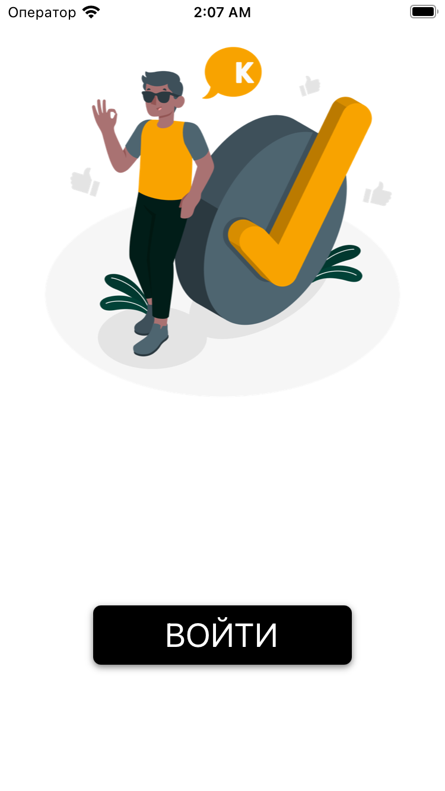
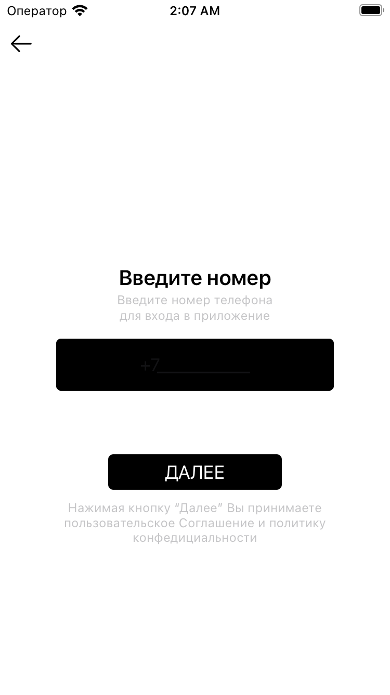
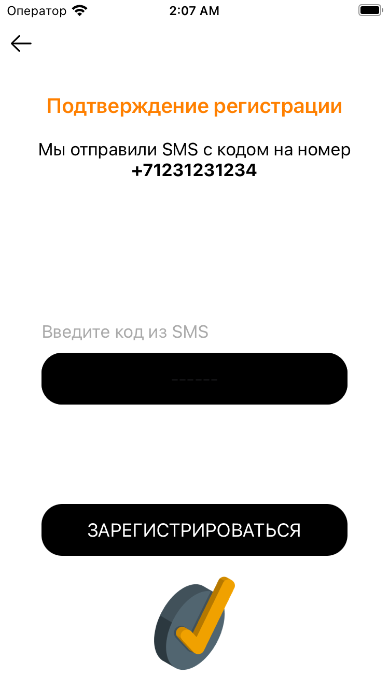
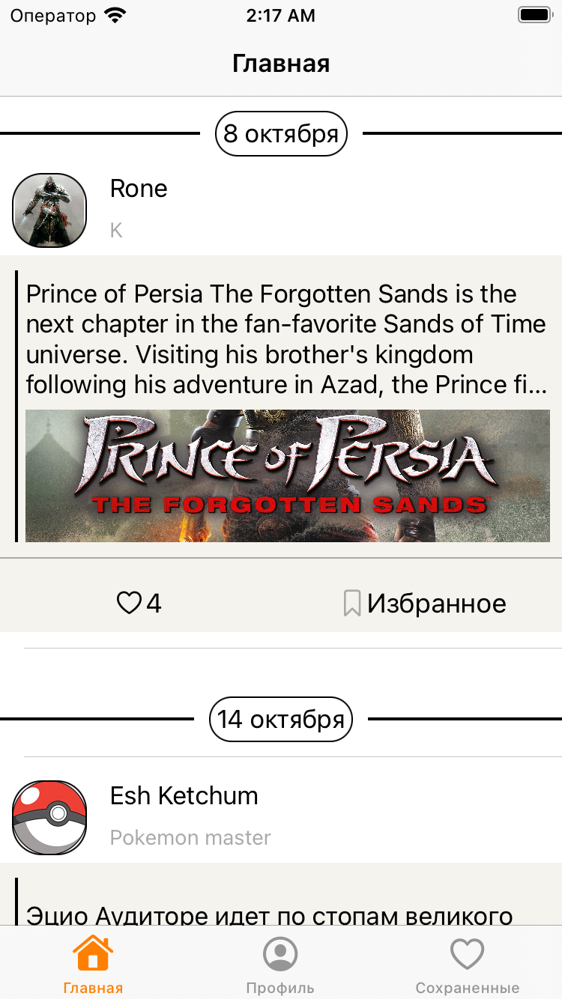
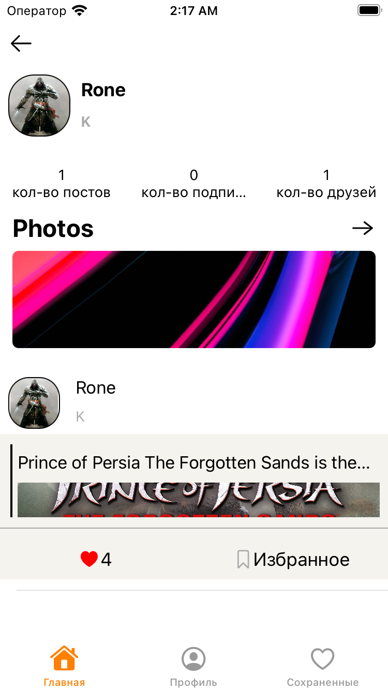
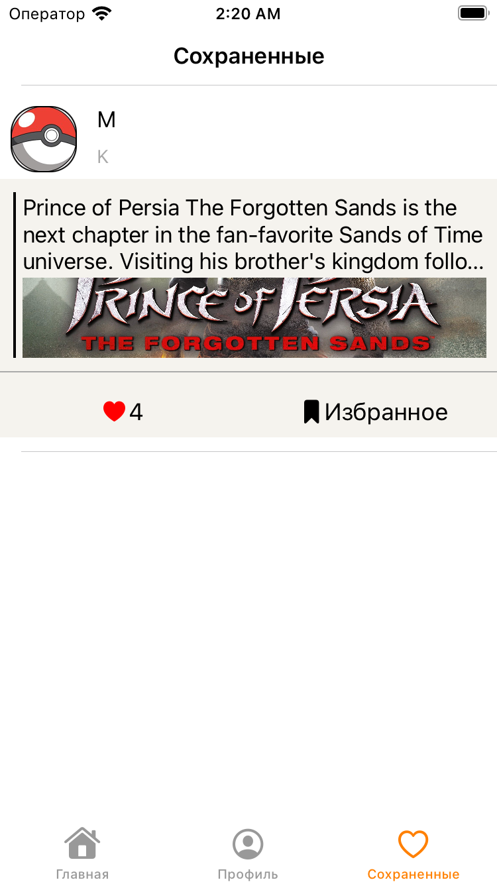

# FriendsFeed

## Стэк проекта

### Архитектура проекта

* MVVM+C

### Используемые фреймворки

* Firebase Firestore
* Firebase Authentication
* Firebase Storage
* SnapKit

## Основной функционал
1. Вход\регистрация в программе
2. Просмотр постов пользователй
3. Просмотр своего профиля и профиля автора поста
4. Добавление\удаление избранных постов
5. Просмотр фотографий пользователя

## Интерфейс приложения
### Экран входа

### Экран ввода логина

### Экран ввода подтверждающего кода

### Экран ленты

### Экран профиля пользователя

### Экран избранных постов
